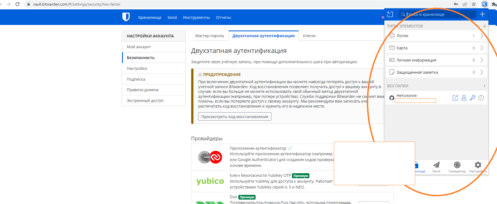
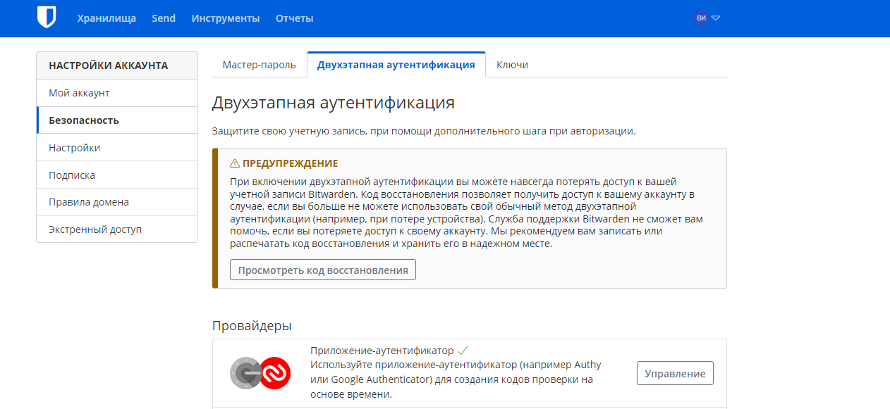

#### 1.1 Установите Bitwarden плагин для браузера. Зарегестрируйтесь и сохраните несколько паролей.

#### 1.2 Установите Google authenticator на мобильный телефон. Настройте вход в Bitwarden акаунт через Google authenticator OTP.

#### Установите apache2, сгенерируйте самоподписанный сертификат, настройте тестовый сайт для работы по HTTPS.

```shell
vagrant@vagrant:~$sudo apt install apache2
...
vagrant@vagrant:~$sudo a2enmod ssl
...
vagrant@vagrant:~$sudo systemctl restart apache2
...
vagrant@vagrant:~$sudo openssl req -x509 -nodes -days 365 -newkey rsa:2048 \
-keyout /etc/ssl/private/apache-selfsigned.key \
-out /etc/ssl/certs/apache-selfsigned.crt \
-subj "/C=RU/ST=Moscow/L=Moscow/O=Company Name/OU=Org/CN=www.example.com"
...
vagrant@vagrant:~$sudo vim /etc/apache2/sites-available/127.0.0.1.conf
<VirtualHost *:443>
 ServerName 127.0.0.1
 DocumentRoot /var/www/127.0.0.1
 SSLEngine on
 SSLCertificateFile /etc/ssl/certs/apache-selfsigned.crt
 SSLCertificateKeyFile /etc/ssl/private/apache-selfsigned.key
</VirtualHost>
...
vagrant@vagrant:~$sudo mkdir /var/www/127.0.0.1
...
vagrant@vagrant:~$sudo vim /var/www/127.0.0.1/index.html
<h1>it worked!</h1>

vagrant@vagrant:~$sudo a2ensite 127.0.0.1.conf
vagrant@vagrant:~$sudo apache2ctl configtest
vagrant@vagrant:~$sudo systemctl reload apache2

vagrant@vagrant:~$ sudo systemctl status apache2
● apache2.service - The Apache HTTP Server
     Loaded: loaded (/lib/systemd/system/apache2.service; enabled; vendor preset: enabled)
     Active: active (running) since Sat 2023-02-18 11:18:52 UTC; 2min 11s ago
       Docs: https://httpd.apache.org/docs/2.4/
    Process: 5939 ExecStart=/usr/sbin/apachectl start (code=exited, status=0/SUCCESS)
    Process: 6074 ExecReload=/usr/sbin/apachectl graceful (code=exited, status=0/SUCCESS)
   Main PID: 5943 (apache2)
      Tasks: 55 (limit: 2240)
     Memory: 6.6M
        CPU: 325ms
     CGroup: /system.slice/apache2.service
             ├─5943 /usr/sbin/apache2 -k start
             ├─6078 /usr/sbin/apache2 -k start
             └─6079 /usr/sbin/apache2 -k start

vagrant@vagrant:~$ curl -k https://127.0.0.1
<h1>it worked!</h1>

vagrant@vagrant:~$

```

#### 4. Проверьте на TLS уязвимости произвольный сайт в интернете (кроме сайтов МВД, ФСБ, МинОбр, НацБанк, РосКосмос, РосАтом, РосНАНО и любых госкомпаний, объектов КИИ, ВПК ... и тому подобное).

```shell
vagrant@vagrant:~/testssl.sh$ ./testssl.sh -U --sneaky https://huawei.ru

###########################################################
    testssl.sh       3.2rc2 from https://testssl.sh/dev/
    (e57527f 2023-02-08 17:07:42)

      This program is free software. Distribution and
             modification under GPLv2 permitted.
      USAGE w/o ANY WARRANTY. USE IT AT YOUR OWN RISK!

       Please file bugs @ https://testssl.sh/bugs/

###########################################################

 Using "OpenSSL 1.0.2-bad (1.0.2k-dev)" [~179 ciphers]
 on vagrant:./bin/openssl.Linux.x86_64
 (built: "Sep  1 14:03:44 2022", platform: "linux-x86_64")


 Start 2023-02-18 12:10:12        -->> 159.138.201.206:443 (huawei.ru) <<--

 rDNS (159.138.201.206): ecs-159-138-201-206.compute.hwclouds-dns.com.
 Service detected:       HTTP


 Testing vulnerabilities

 Heartbleed (CVE-2014-0160)                not vulnerable (OK), no heartbeat extension
 CCS (CVE-2014-0224)                       not vulnerable (OK)
 Ticketbleed (CVE-2016-9244), experiment.  not vulnerable (OK)
 ROBOT                                     not vulnerable (OK)
 Secure Renegotiation (RFC 5746)           supported (OK)
 Secure Client-Initiated Renegotiation     not vulnerable (OK)
 CRIME, TLS (CVE-2012-4929)                not vulnerable (OK)
 BREACH (CVE-2013-3587)                    no gzip/deflate/compress/br HTTP compression (OK)  - only supplied "/" tested
 POODLE, SSL (CVE-2014-3566)               not vulnerable (OK)
 TLS_FALLBACK_SCSV (RFC 7507)              Downgrade attack prevention supported (OK)
 SWEET32 (CVE-2016-2183, CVE-2016-6329)    not vulnerable (OK)
 FREAK (CVE-2015-0204)                     not vulnerable (OK)
 DROWN (CVE-2016-0800, CVE-2016-0703)      not vulnerable on this host and port (OK)
                                           make sure you don't use this certificate elsewhere with SSLv2 enabled services, see
                                           https://search.censys.io/search?resource=hosts&virtual_hosts=INCLUDE&q=692B5DCDA5BC5C16E1D55F7ECD846177680B2A832DAB97333F1E65BDDE9E4171
 LOGJAM (CVE-2015-4000), experimental      not vulnerable (OK): no DH EXPORT ciphers, no DH key detected with <= TLS 1.2
 BEAST (CVE-2011-3389)                     TLS1: ECDHE-RSA-AES128-SHA ECDHE-RSA-AES256-SHA AES256-SHA AES128-SHA
                                           VULNERABLE -- but also supports higher protocols  TLSv1.1 TLSv1.2 (likely mitigated)
 LUCKY13 (CVE-2013-0169), experimental     potentially VULNERABLE, uses cipher block chaining (CBC) ciphers with TLS. Check patches
 Winshock (CVE-2014-6321), experimental    not vulnerable (OK) - ARIA, CHACHA or CCM ciphers found
 RC4 (CVE-2013-2566, CVE-2015-2808)        no RC4 ciphers detected (OK)


 Done 2023-02-18 12:10:49 [  42s] -->> 159.138.201.206:443 (huawei.ru) <<--

vagrant@vagrant:~/testssl.sh$

```

-------------------------------------------------------------------------------------------------------------------------------------------------------------------
#### 5. Установите на Ubuntu ssh сервер, сгенерируйте новый приватный ключ. Скопируйте свой публичный ключ на другой сервер. Подключитесь к серверу по SSH-ключу.

```shell
vagrant@vagrant-1:~$ sudo systemctl start sshd.service
vagrant@vagrant-1:~$ sudo systemctl enable sshd.service
Failed to enable unit: Refusing to operate on alias name or linked unit file: sshd.service
vagrant@vagrant-1:~$ ssh-keygen
Generating public/private rsa key pair.

Enter file in which to save the key (/home/vagrant/.ssh/id_rsa): Enter passphrase (empty for no passphrase):
Enter same passphrase again:
Passphrases do not match.  Try again.
Enter passphrase (empty for no passphrase):
Enter same passphrase again:
Your identification has been saved in /home/vagrant/.ssh/id_rsa
Your public key has been saved in /home/vagrant/.ssh/id_rsa.pub
The key fingerprint is:
SHA256:w52hwzC/QJwxh0VqoVjYRvt5fZJyp4K7jp2BvyHDjH8 vagrant@vagrant-1
The key's randomart image is:
+---[RSA 3072]----+
|   +o +++        |
|  .oo+.B         |
|  ..o O   .      |
|     + B + +     |
|      + S B o    |
|   + . + * =     |
|  . * + o .      |
|   . *E= .       |
|    ooOo         |
+----[SHA256]-----+
vagrant@vagrant-1:~$
vagrant@vagrant-1:~$ cat /home/vagrant/.ssh/id_rsa.pub
ssh-rsa AAAAB3NzaC1yc2EAAAADAQABAAABgQCtBJWaEjIw4IJ1kVfNvHedAdS9dulkzfxMk+Zv+43kbHQnhnjUuloh2y6OfAiBDYbhggaPgoasG8FloFTbppZDX9nB2q+6dge1wjv/w32BAbY2mYNpWScS0ZJGa3htBnyBBnpok7+XH7v2B0QTr6hqIUifVsW+pFgr+JymTax72qAOjloNz29Fbip3cl2kpXI29WSHPHXsLfLUXEoJyunyWKcpZDk+pHnAhhWryOzD7kid759GmYCN9ej1l8nR4id6RxO0SkvEYpaxAj72jgrNQrT0a95lEucbrTBVvgbJFng/0ZbCeoVPK5tLjco/jvM5LC3qhtJlqYASXNi9m52RZnrjdqaHOgaGbXzyc0ePKmELVmTqnJecoRONVzlZK1qtfUQI4URRSZvTUkcbEAIHZiDBfk5bIKkx5+C7prP5D2GSHoyNi5vI6a7mrz0cwe+QbhsFzwu2Nrf6Yki21r0CuUOV4636uWBzV+9sIFypLlxX4FhTOYe0RW4co8ecp20= vagrant@vagrant-1
vagrant@vagrant-1:~$ cat ~/.ssh/authorized_keys
ssh-rsa AAAAB3NzaC1yc2EAAAADAQABAAABAQDRAIj5sQuGfBUDUpgLvhbYRXC7y286SQUKFsH6MIHMxrF9zxueKV2OYjE9BePt/Dz3VpEsx54aOie551V2bwXIABaf54CrPeawKib9TFuacPwcCxWMitoMRtrC9IdbnxUwKyiwUwjhYTduk+mnxSNKndd6cucMMmJ4slcoSkFYLQ0Le+EJJThhJTzbUZg8b4ABLnxPRBPkg0rY7eKy0suCTjJ3vlIOsAo9HMXgC3lrhkAMOr7qjIIOEIqyDtq1puWC1V4WQqLnCDXOI/07xGBlOzgQVBi8oYnLoZP86iYuw3EWtZ+FqQTB93ft88jRqeRW8VQmF8Y/rdkRRY+scsNJ vagrant

vagrant@vagrant-1:~$ ssh test_ssh@127.0.0.1
Welcome to Ubuntu 22.04 LTS (GNU/Linux 5.15.0-30-generic x86_64)

 * Documentation:  https://help.ubuntu.com
 * Management:     https://landscape.canonical.com
 * Support:        https://ubuntu.com/advantage

```


#### 6. Переименуйте файлы ключей из задания 5. Настройте файл конфигурации SSH клиента, так чтобы вход на удаленный сервер осуществлялся по имени сервера.

```shell
vagrant@vagrant-1:~$ sudo cp ~/.ssh/id_rsa ~/.ssh/id_rsa_test_ssh


vagrant@vagrant-1:~$ ssh test_ssh
Load key "/home/vagrant/.ssh/id_rsa_test_ssh": Permission denied
test_ssh@127.0.0.1's password:
Welcome to Ubuntu 22.04 LTS (GNU/Linux 5.15.0-30-generic x86_64)

 * Documentation:  https://help.ubuntu.com
 * Management:     https://landscape.canonical.com
 * Support:        https://ubuntu.com/advantage

  System information as of Sat Feb 18 01:06:19 PM UTC 2023

  System load:  0.080078125        Processes:             132
  Usage of /:   13.7% of 30.34GB   Users logged in:       1
  Memory usage: 13%                IPv4 address for eth0: 10.0.2.15
  Swap usage:   0%


This system is built by the Bento project by Chef Software
More information can be found at https://github.com/chef/bento
Last login: Sat Feb 18 12:48:34 2023 from 127.0.0.1


vagrant@vagrant-1:~$ sudo cp ~/.ssh/id_rsa ~/.ssh/id_rsa_test_ssh
vagrant@vagrant-1:~$ sudo nano ~/.ssh/config
Host test_ssh
        HostName 127.0.0.1
        User test_ssh
        Port 22
        IdentityFile ~/.ssh/id_rsa_test_ssh

vagrant@vagrant-1:~$ ssh test_ssh
Load key "/home/vagrant/.ssh/id_rsa_test_ssh": Permission denied
test_ssh@127.0.0.1's password:
Welcome to Ubuntu 22.04 LTS (GNU/Linux 5.15.0-30-generic x86_64)

 * Documentation:  https://help.ubuntu.com

```


